# Lab agents — actions & interactions

The lab is an **event-driven** system. Every interaction is one of ~41 event types flowing through the
dispatcher (`harness/dispatch.py`). To understand any agent, read three registries:

- **`harness/main.py`** — `dispatcher.register("<event>", <handler>)`: what each agent **consumes**.
- **`harness/loop_engine.py`** — the `Transition` registry: the declarative *"when condition X holds,
  emit event Y (owner Z)"* backbone that drives + re-arms the research loop.
- **`grep emit_corpus_event` in `agents/<name>/`** (+ a few direct `INSERT INTO events` inside
  `state/client.py`): what each agent **produces**.

Mode-dial: the dispatcher derives an agent's dial from its module path (`agents.<name>.* → <name>`,
`harness/agent_modes.py:agent_of`) and runs it only when the dial is `advisory|active`. Loop-engine
transitions are gated by `Transition.owner`.

> This file is hand-maintained from those registries. The diagrams below render on GitHub / most IDEs.

---

## 1. The whole system

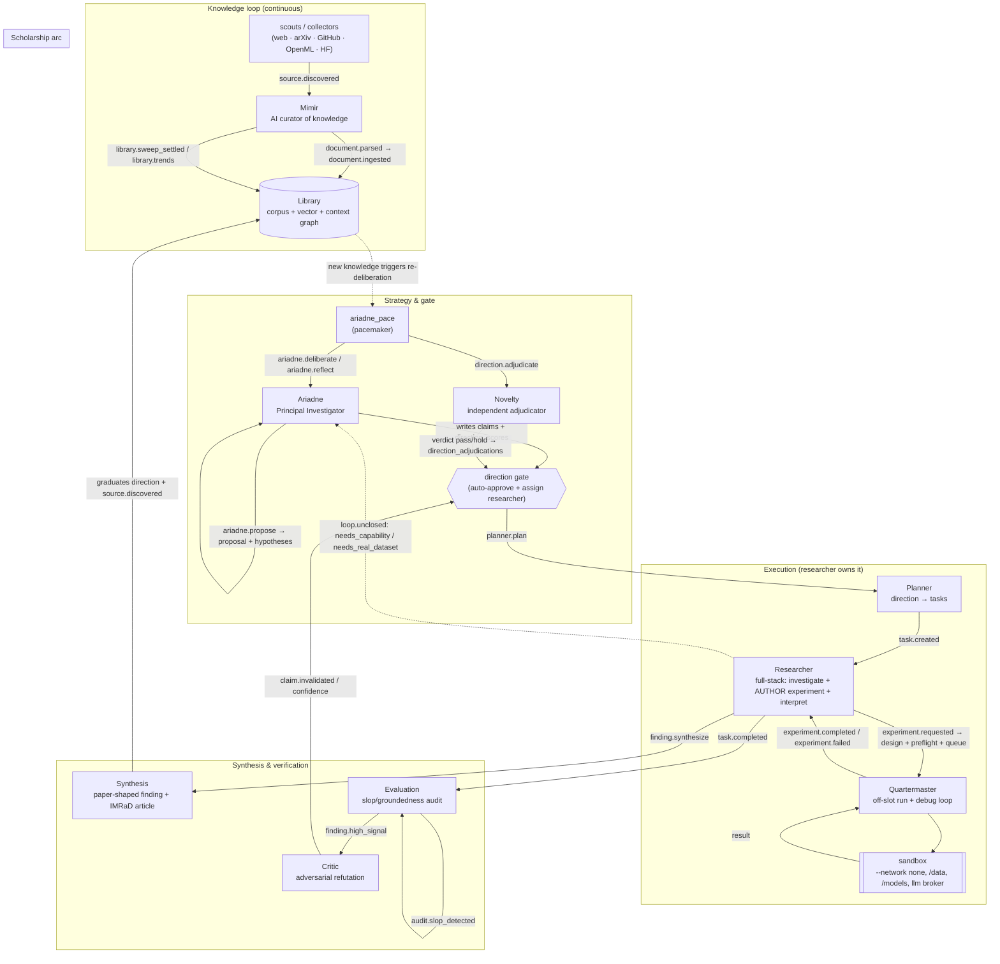

**The spine in one line:** new knowledge → Ariadne frames a *direction* → Novelty adjudicates → the
gate approves + **assigns a researcher** → Ariadne writes the review + proposal → Planner makes tasks →
the **Researcher authors** experiments → the **Quartermaster** runs them → the Researcher interprets →
**Synthesis** composes the finding → Evaluation + Critic stress it → the finding re-enters the Library
and feeds Ariadne's next deliberation.

---

## 2. Event taxonomy

| Class | Events | Notes |
|---|---|---|
| **Loop-advancing** | `ariadne.deliberate/reflect/review/propose`, `direction.adjudicate`, `planner.plan`, `task.created/completed`, `experiment.requested/completed/failed`, `finding.synthesize`, `synthesis.article`, `finding.high_signal`, `audit.slop_detected` | each has exactly one consuming handler |
| **Knowledge** | `source.discovered`, `document.parsed`, `document.ingested`, `acquire.requested/fulfilled/rejected`, `library.sweep_requested/settled`, `library.trends`, `mimir.ask/answered/ingest_blocked` | Mimir's intake + Q&A |
| **Lifecycle** | `claim.created` (→ Neo4j sink), `claim.invalidated`, `claim.confidence_changed`, `direction.reopened` | claim/direction state changes |
| **Indicators / telemetry** | `loop.unclosed`, `lab.pulse`, `quartermaster.snapshot`, `dispatch.saturated`, `session.*`, `step.*`, `queue.empty`, `lessons.reconciled` | poll-consumed / closure guard (CLOSURE_EXEMPT in `harness/dispatch.py`) |

---

## 3. Individual agents

Each diagram reads left→right: **events consumed** → **the agent + what it does** → **events/writes produced**.

Every live singleton agent is a **named, persistent identity** (migration 024 `agent_identities`); the
curator resolves each one's system persona from that registry (falling back to the `SYSTEM_PROMPTS`
code anchor if a row is missing). `agent_modes` is the control dial; `agent_identities` is the
persona/name layer — same `agent_name` key, two concerns. The researcher roster (`researchers`,
migration 022) is the one multi-member identity.

| `agent_name` | identity | role |
|---|---|---|
| `ariadne` | **Ariadne** | Principal Investigator (frames mission + directions) |
| `mimir` | **Mimir** | Warden of the Library (curation, trust, GraphRAG) |
| `novelty` | **Themis** | independent prior-art adjudicator |
| `planner` | **Metis** | direction → research tasks |
| `synthesis` | **Calliope** | finding + article author |
| `evaluation` | **Aletheia** | groundedness / slop audit |
| `critic` | **Momus** | adversarial refutation |
| `reflection` | **Mnemosyne** | lessons / memory reconciliation |
| `researcher` | **Daedalus · Hypatia · Heron** | full-stack researchers (roster) |
| `quartermaster` | *(ops loop, unnamed)* | resource + experiment execution |

Edit them with `python -m ops.identities` (singletons) / `python -m ops.researchers` (the roster).

### Ariadne — Principal Investigator (`agents/ariadne/`, paced by `harness/ariadne_pace.py`)
Frames the mission + falsifiable directions, scores them against the field model, writes the literature
review + proposal, and steers the standing agenda. Strategy only — never executes.

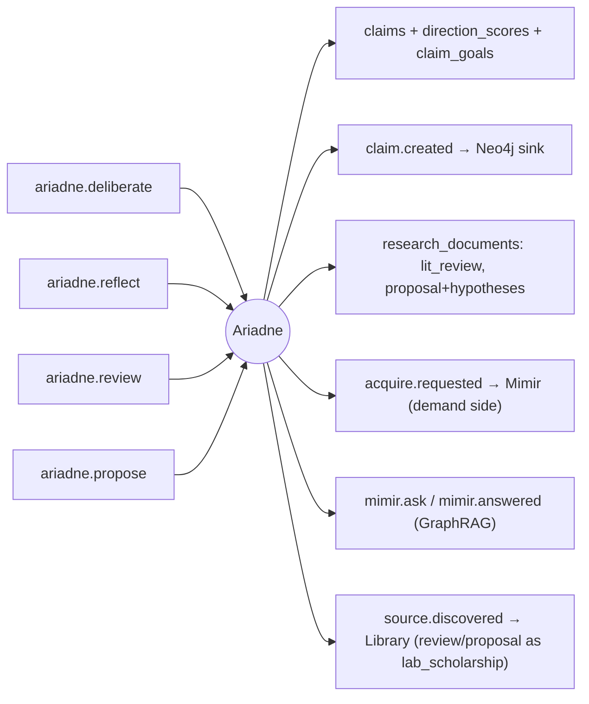

> The gate approval + `researcher_id` assignment is done by `ariadne_pace._auto_approve` (reading
> Novelty's `verdict='pass'` + the self-score floors), not by Ariadne's handler itself. `ariadne.deliberate`/
> `reflect` are **pacemaker-only** (the loop engine does not own them); the rest of the arc
> (`adjudicate`/`plan`/`review`/`propose`/`article`/`experiment.requested`) is driven by either the
> loop-engine transitions or the legacy `_maybe_*` pacemaker steps.

### Themis — independent adjudicator (`agents/novelty/handler.py`, `agent_name=novelty`)
The external prior-art check. Reads the nearest corpus prior art (excluding the lab's own) + prior
directions, scores novelty/impact, and returns a deterministic pass/hold (OR-verdict: high-impact
passes at modest novelty).

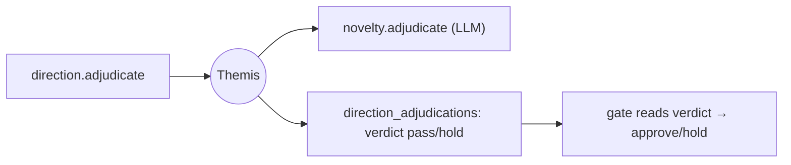

### Metis — direction → tasks (`agents/planner/`, `agent_name=planner`)
Decomposes an approved direction into 1–2 lean research tasks (department='research'), inheriting the
direction's owning researcher.

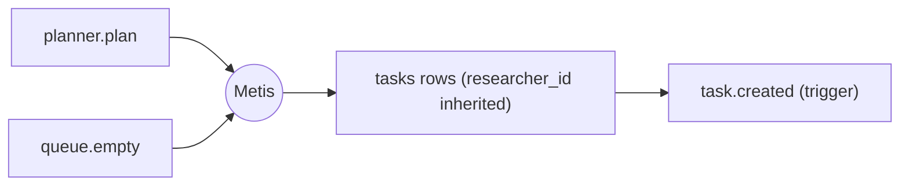

### Researcher — full-stack author (`agents/researcher/`)
ML engineer + SW engineer + scientist in one. Investigates a task against the Library; when a number
needs an experiment, it **authors** the experiment (design + preflight), and later **interprets** its own
result. Every experiment is linked to a specific researcher.

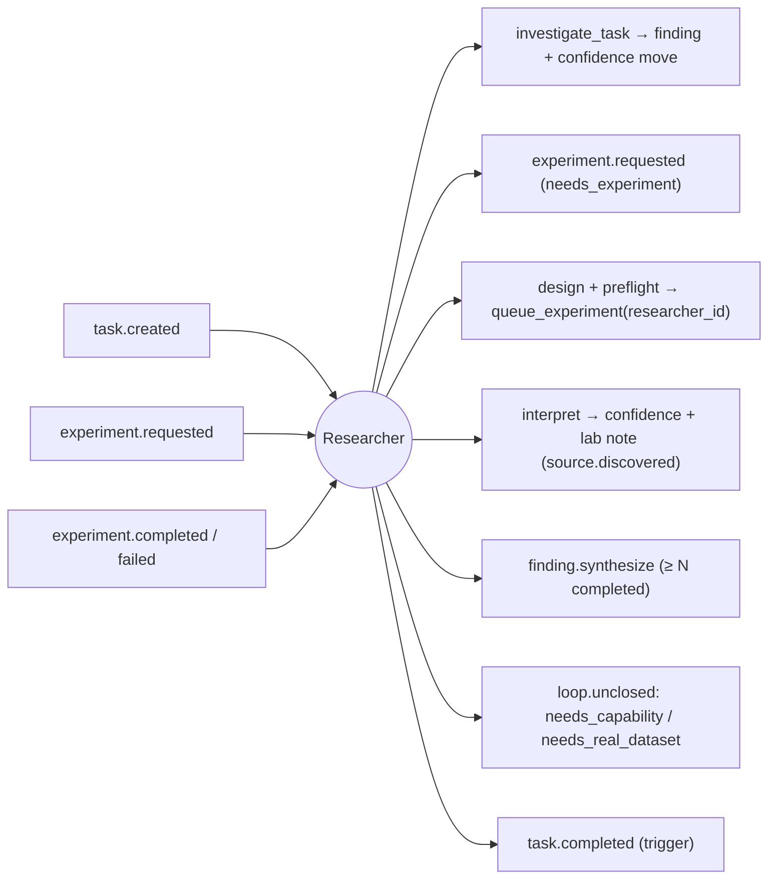

### Quartermaster — experiment execution (`harness/quartermaster.py`)
A background watchdog (not a dispatcher handler). Allocates CPU/GPU, runs each queued experiment in the
hardened sandbox, drives the design→run→debug retry loop off-slot, and records the outcome.

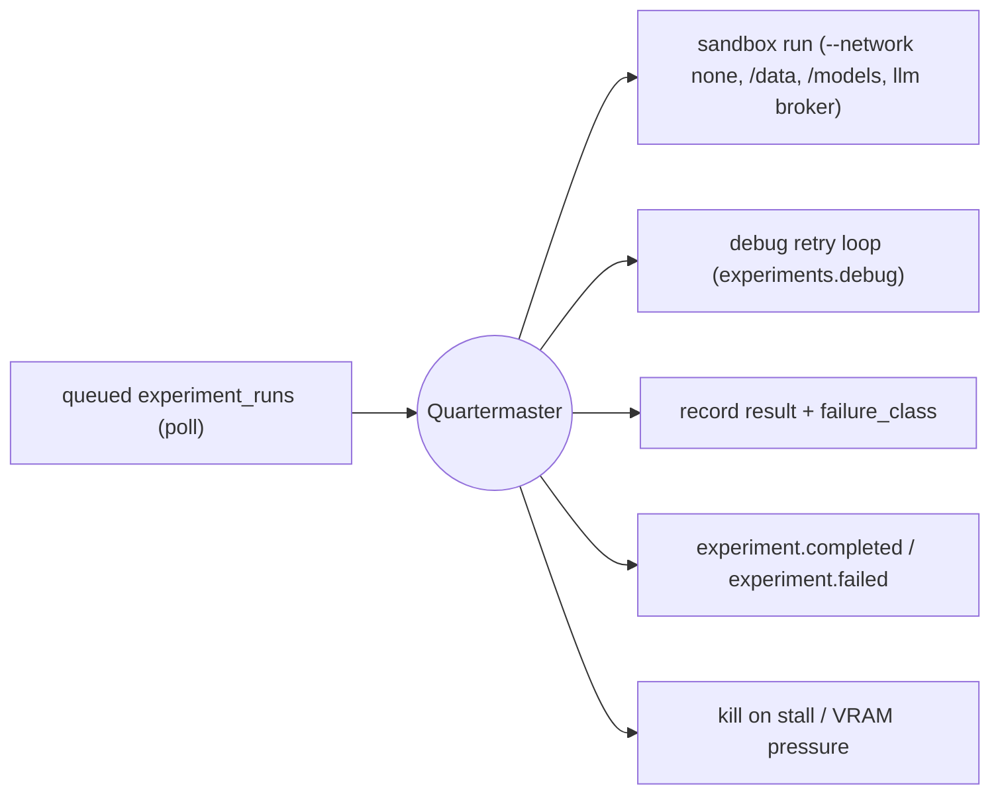

### Calliope — finding & article (`agents/synthesis/`, `agent_name=synthesis`)
Reads across a direction's completed experiments to compose the single paper-shaped `ResearchFinding`,
graduates the direction's lifecycle status (a decisive + confident finding reaches **concluded**), and
(written arc) composes the IMRaD article (citation-graded). Hands each finding to the verification spine.

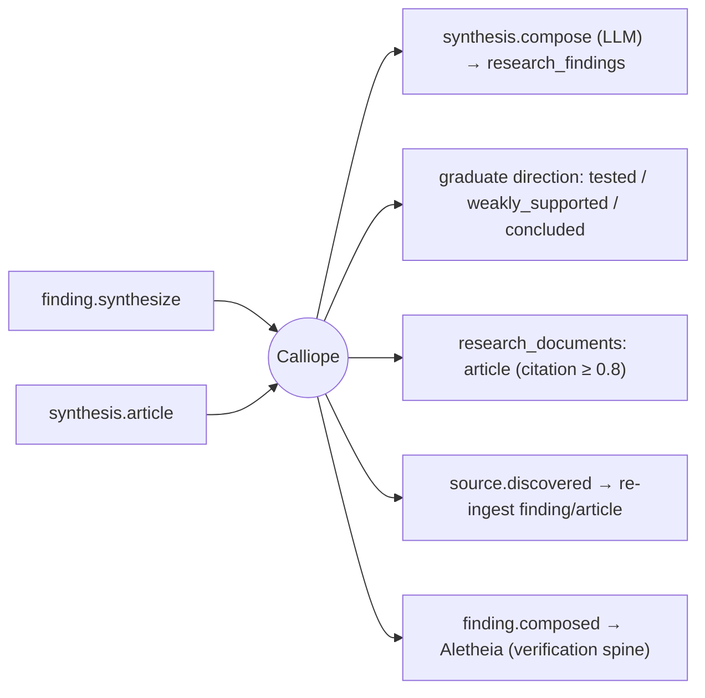

### Aletheia — slop/groundedness audit (`agents/evaluation/`, `agent_name=evaluation`)
Audits a synthesized `research_finding` for substance + groundedness against its experiments; a
confident pass promotes it to high-signal (arming Momus). Also keeps the legacy per-task finding audit
+ the per-claim slop circuit-breaker.

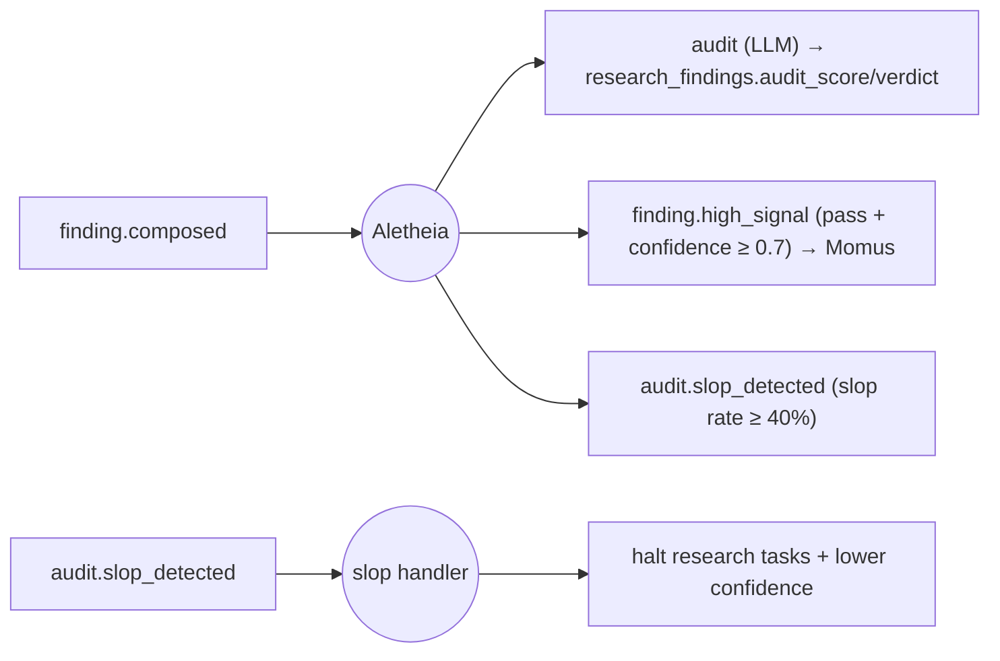

### Momus — adversary (`agents/critic/`, `agent_name=critic`)
For each high-signal finding, runs a targeted refutation pass (plans an attack, fetches counter-evidence,
stress-tests, judges) and emits watch / weaken / kill. Directions are weaken-only.

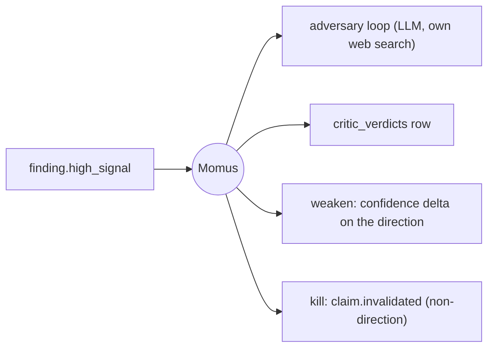

### Mimir — curator of knowledge (`agents/mimir/`)
The knowledge engine: ingests discovered sources (parse → embed → trust/certify → graph), runs discovery
sweeps + self-healing acquires, and answers agents' multi-hop questions over the corpus.

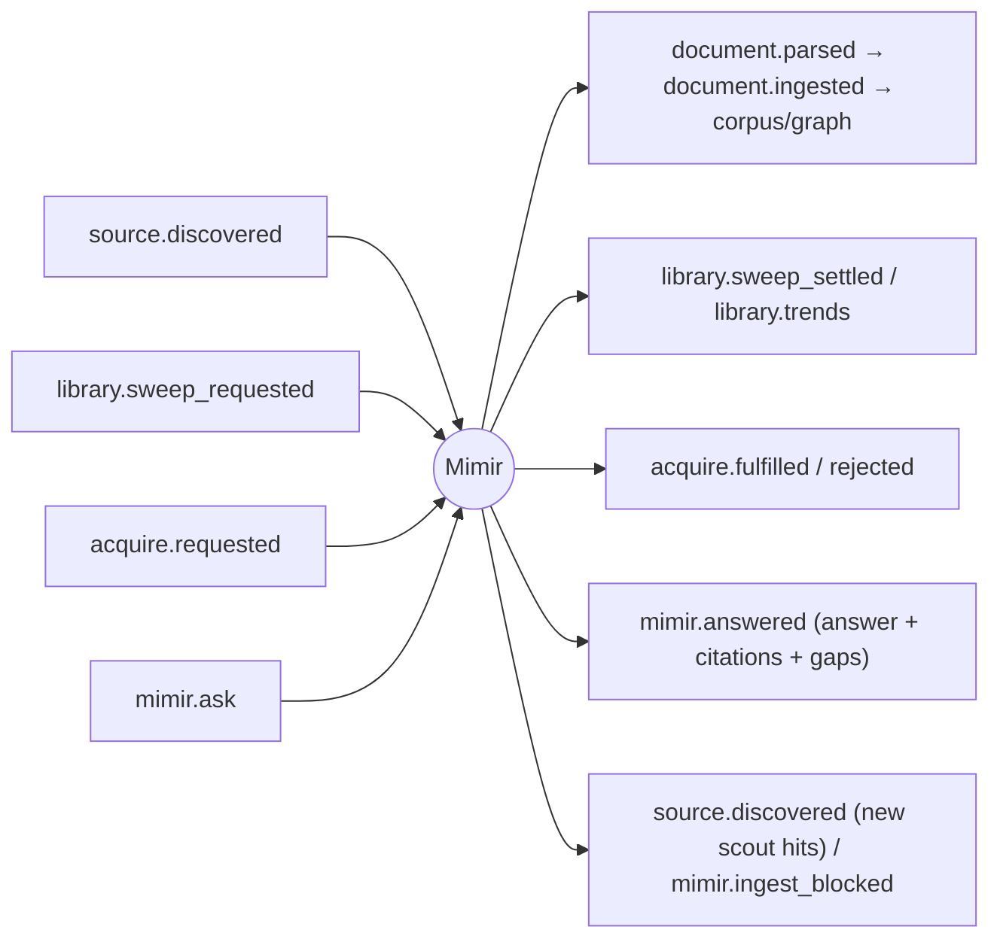

### Mnemosyne — lessons / memory (`agents/reflection/`, `agent_name=reflection`)
Consumes `reflection.requested` to reconcile lessons / steer; lightweight.

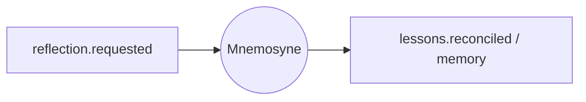

### Removed / dormant
- **pi** (`agents/pi/`) — market-era PI; **neutralized** (trigger + handlers cut, Stage 0) and dropped from
  the dial. Directory removal is a deferred follow-up (still bench-coupled); inert at runtime.
- **librarian** — **deleted** (was collapsed into Mimir long ago).
- **reviewer** — **deleted** (empty stub; its output-gate role is covered by Aletheia + Momus + Calliope's
  citation grading). The `reviewer`/`auditor` mode dials were removed too.

---

## 4. Closed loops & anti-stall guards

The `loop_engine` re-arm transitions re-issue an in-band event if it was missed, so the loop self-heals:

| Transition (owner) | Re-emits | When |
|---|---|---|
| `adjudicate` (novelty) | `direction.adjudicate` | scored, un-adjudicated directions exist |
| `plan` (planner) | `planner.plan` | approved direction with no tasks |
| `arc_review` / `arc_propose` / `arc_article` (ariadne/synthesis) | the arc event | a scholarship doc is missing |
| `experiment_coverage` / `confirm_real_data` (experiments) | `experiment.requested` | direction under the coverage target / needs real-data confirmation |
| `rearm_interpret` (experiments) | `experiment.completed/failed` | a settled run was never interpreted |
| `rearm_conclude` (synthesis) | `finding.synthesize` | enough evidence, no finding |
| `rearm_audit` (evaluation) | `finding.composed` | a `research_finding` is unaudited (`audit_verdict IS NULL`) |
| `rearm_attack` / `rearm_attack_research` (critic) | `finding.high_signal` | high-signal finding never challenged |

`loop.unclosed` is the closure-guard indicator: "work was produced but the consumer that should advance
it never ran" (also the researcher's `needs_capability` / `needs_real_dataset` signals to Ariadne).
`CLOSURE_EXEMPT_EVENTS` (in `harness/dispatch.py`, shared with `ops.closure_audit`) excludes telemetry/
poll-consumed events so they're never false-flagged.

**Two structural loop-closers from the agent consolidation:**
- **Conclude wall:** `ariadne.persist` only supersedes *un-worked* directions on a re-frame (no completed
  experiment_run and no research_finding), so a worked direction survives to reach `concluded`.
- **Tasking guard (migration 026):** a BEFORE-INSERT trigger on `tasks` SKIPS a `department='research'`
  task on a MISSION/FINDING claim; `ops.reap_orphan_tasks --halt` clears historical zombies.

---

## 5. Best ways to keep understanding this

1. **The registries (authoritative):** `harness/main.py` (consumes), `harness/loop_engine.py` (the
   transition backbone), `grep -rn emit_corpus_event agents/ harness/` + the `INSERT INTO events` in
   `state/client.py` (produces). Cross-reference = this graph.
2. **Live flow:** `SELECT event_type, count(*), max(emitted_at) FROM events GROUP BY 1` shows what's
   actually firing; `ops.experiment_audit`, `ops.closure_audit`, and `ops.lab_doctor` summarize health.
3. **The floorplan UI** (`/`) — the same graph, live, as rooms + flow edges.
4. **This doc** — regenerate the diagrams whenever a `register()` line or a `Transition` is added.
