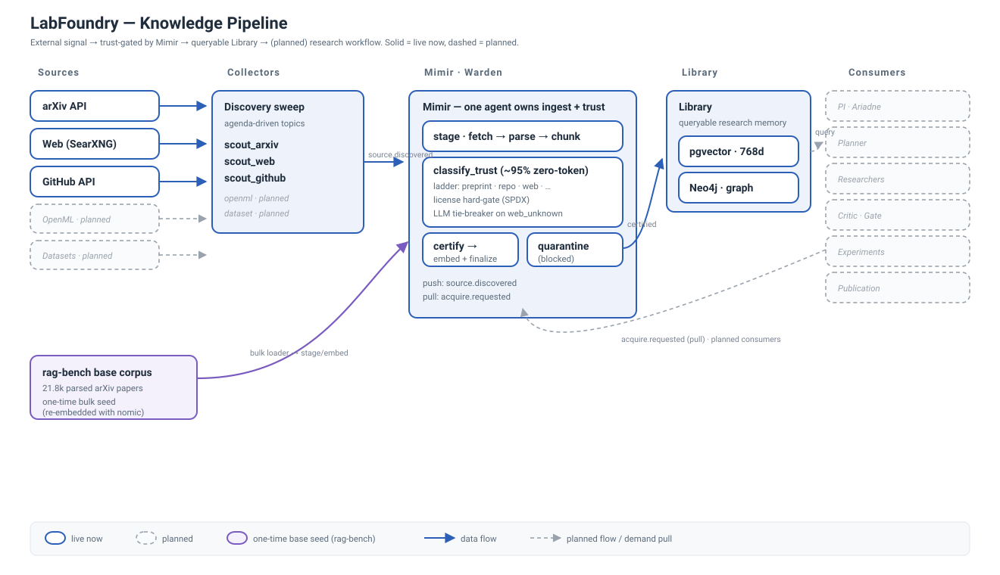

# LabFoundry — architecture

External signal is **trust-gated by Mimir**, lands in a **queryable Library**, and
(later) feeds a **research workflow**. The lab runs the left half today; the
research agents are planned.



## Data flow

```mermaid
flowchart LR
  subgraph SRC["Sources"]
    arxiv["arXiv API"]:::live
    web["Web · SearXNG"]:::live
    gh["GitHub API"]:::live
    openml["OpenML"]:::plan
    ds["Datasets"]:::plan
  end

  ragbench["rag-bench base corpus<br/>21.8k arXiv papers<br/>(one-time bulk seed)"]:::seed

  subgraph COL["Collectors — discovery sweep"]
    scouts["scout_arxiv · scout_web · scout_github<br/>(openml/dataset planned)"]:::live
  end

  subgraph MIMIR["Mimir — one agent owns ingest + trust"]
    stage["stage: fetch → parse → chunk"]:::live
    trust["classify_trust (~95% zero-token)<br/>trust ladder · license SPDX gate<br/>LLM tie-breaker on web_unknown"]:::live
    certify["certify → embed + finalize"]:::live
    quar["quarantine (blocked)"]:::live
    stage --> trust
    trust -->|approve| certify
    trust -->|block| quar
  end

  subgraph LIB["Library — queryable research memory"]
    pg["pgvector · 768d"]:::live
    kg["Neo4j · graph"]:::live
  end

  subgraph CONS["Consumers — research workflow (planned)"]
    pi["PI · Ariadne"]:::plan
    plan["Planner"]:::plan
    res["Researchers"]:::plan
    crit["Critic · Gate"]:::plan
    exp["Experiments"]:::plan
    pub["Publication"]:::plan
  end

  arxiv --> scouts
  web --> scouts
  gh --> scouts
  openml -.-> scouts
  ds -.-> scouts

  scouts -->|source.discovered| stage
  ragbench -.bulk loader.-> stage
  certify --> pg
  certify --> kg
  pg -.query.-> CONS
  CONS -.acquire.requested / pull.-> stage

  classDef live fill:#fff,stroke:#2c5fb8,stroke-width:2px,color:#1f2d3d;
  classDef plan fill:#fafbfc,stroke:#9aa3ad,stroke-width:1.5px,stroke-dasharray:5 4,color:#9aa3ad;
  classDef seed fill:#f4f0fc,stroke:#7a5cc0,stroke-width:2px,color:#5a3fa0;
```

## What's live now

- **Collectors** — `scout_arxiv`, `scout_web` (SearXNG), `scout_github`. OpenML/dataset
  scouts are not built yet.
- **Mimir** — the single agent that owns ingest *and* trust: stage → `classify_trust`
  (deterministic ladder + SPDX license hard-gate + an LLM tie-breaker only on the
  ambiguous `web_unknown` boundary) → certify (embed + finalize) or quarantine. Two
  intake paths: **push** (`source.discovered` from the sweep) and **pull**
  (`acquire.requested`, for when a consumer needs a specific source).
- **Library** — the certified corpus in pgvector (768-d, `nomic-embed-text`) with a
  best-effort Neo4j projection.
- **Base corpus** — seeded once from the rag-bench dump (~21.8k arXiv papers) via
  `ops.seed_corpus`; re-embedded with nomic (rag-bench's BGE/1024-d vectors aren't
  portable to our 768-d corpus, so only the text is reused).

## Planned next

The whole **research workflow** — PI (Ariadne), Planner, Researchers, Critic, Gate,
Experiments, Publication — queries the Library and pulls sources on demand. Wired in
the harness but dormant until turned on (they fire only on `task.created`, which only
the PI bootstrap produces).
